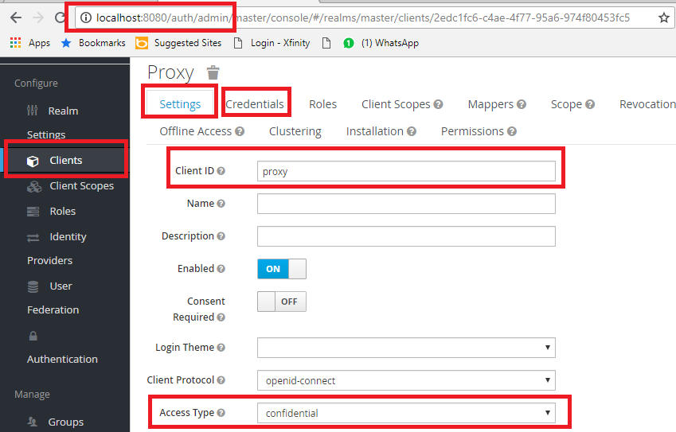

# Goal
I was looking for an simple but effective way to secure a suite of RESTful API written in different languages. I wanted the security to be based in OIDC and to allow flexible routing to the back-end APIs. I looked into:

1. Open Resty with lua_oidc plugin
2. AWS API Gateway
3. AWS Application Load Balancers

I decided to go with the first option because it supported my two main requirements and was deployable on-premise and in the cloud do to container support. I forked from [Evry's repo](https://github.com/evry/docker-oidc-proxy) (i.e. see ref 2). 

# Set up

## Docker Compose

There are two compose files `docker-compose` builds from this repo. `docker-compose-all` uses a pre-built proxy image.

### Pre-requisites
You need to run the KeyCloak server the first time and login to set up the OIDC client. Before all that you need to create a .env file and create environment variables settings for four environment variables needed:
* KEYCLOAK_USER - user name for keycloak Admin console
* KEYCLOAK_PASSWORD - password for keycloak Admin console
* PROXY_CLIENT_SECRET - Client ID that you'll get from Keycloak ID server. See steps below
* PROXY_SESSION_SECRET - Random hash. Use anything.

Follow steps below to set up client and get value for `PROXY_CLIENT_SECRET`.

__*Steps*__

1. Run `docker-compose -f docker-compose-all.yml up -d`.
2. Navigate to `http://localhost:8080/auth` and click on Admin Console link
3. Log in using the `KEYCLOAK_PASSWORD` and `KEYCLOAK_PASSWORD` values from the .env you set up
4. Configure the client. See ref 1 and image below. Ensure Client ID is `proxy` and Access Type is `confidential`
5. Navigate to Credentials tab and copy the value in textbox labeled `secret`.
6. Set `PROXY_CLIENT_SECRET` value in .env to the value of `secret`.
7. Shutdown containers using `docker-compose -f docker-compose-all.yml down`

### Execute Compose
If you've already done the prerequisites you can use the application by starting up compose with the follow steps. These steps will work until you purge your docker volumes, after which time you will need to redo the Keycloak set up.

1. Run `docker-compose -f docker-compose-all.yml up -d`
2. Navigate browser to `http://localhost:5678`
3. Enter credentials from pre-requisite into the prompt, after which you should see a simple site with words `Protected by MLI Proxy`.

# Known issues
Docker build may fail on Windows with main compose file with '.. unknown file or directory ..' error. Use `dos2nix` utility to convert the endings on `bootstrap.sh` file.

# References
1. [Creating an OIDC client in Keycloak](https://www.keycloak.org/docs/3.0/server_admin/topics/clients/client-oidc.html)
2. [docker-oidc-proxy Repo](https://github.com/evry/docker-oidc-proxy)
3. [Original README.md](README_orig.md)